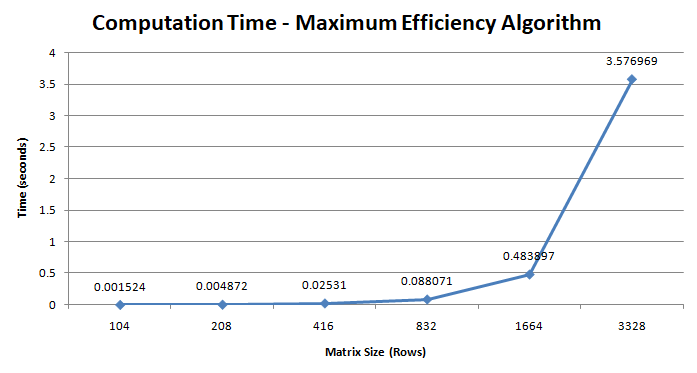
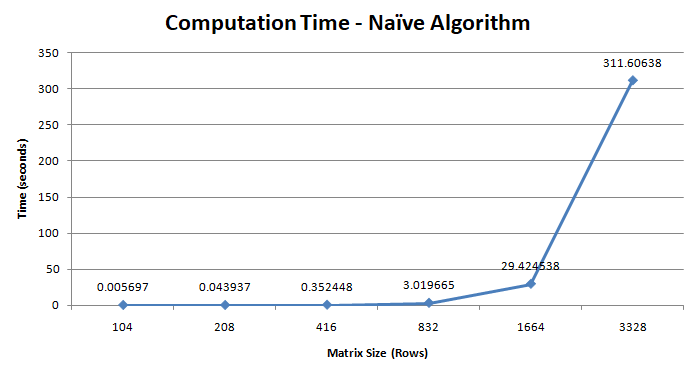
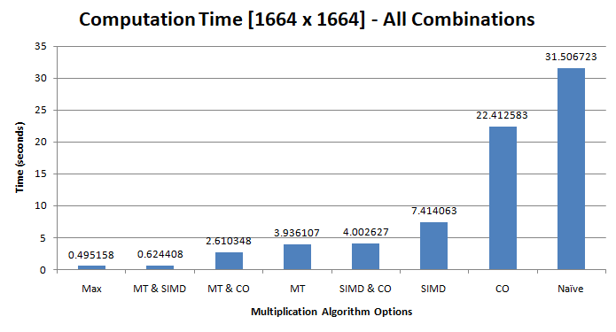

# Project 2: Matrix Multiplication Optimization

## Submission Information

**Andrew Prata, (https://github.com/apratajr/AdvancedComputerSystems/)**

*ECSE 4320: Advanced Computer Systems* Fall 2023

Due: 18-Oct-2023

## Installation and Usage

### Installing matTest
The name of the testing program is *Matrix Multiplication Optimization Testing* (`matTest.exe`). To install the program on your computer and perform testing yourself, you can either clone the entire repository, or download the C++ source files only. Assuming that the class header file is located in the same folder as the main file, the following `g++` command is valid from this folder:

    g++ ./main.cpp -o matTest.exe -mavx2 -mfma

This command will generate the `matTest.exe` executable file. The compiler flags `-mavx2` and `-mfma` are necessary for compilation of the AVX intrinsics that are used in the SIMD implementation. This is technically all that you need for installation! See below for running the program. 
### Using matTest
Ensure that you are in the directory where `matTest` is located. The command-line syntax for running this program in your command window is as follows:

    matTest <multithreading> <simd> <cache optimization> <matrix type> <matrix size>

The arguments listed can be set as follows:

- `multithreading`: `0` for disabled, `1` for enabled
- `simd`: same as above
- `cache optimization`: same as above
- `matrix type`: `int` for fixed-point integer matrices, `float` for floating point number matrices
- `matrix size`: an integer to define the row and column dimensions of the matrices (matrices are square)

An example usage is shown below:

    matTest 1 0 0 float 1500

This exact syntax will perform matrix-matrix multiplication using two 1500 x  1500 matrices whose elements are of type float. It will perform this multiplication with Multithreading enabled, SIMD disabled, and Cache Optimization disabled.

### Sample Output for matTest

The output for the example at the end of the last subsection is shown below. Of primary interest to our upcoming analysis is the `Elapsed time` for matrix multiplication under different states of optimization (this is the last line of the command output).

    E:\Path\To\Program\Directory> matTest 1 0 0 float 1500

            Matrix Multiplication Optimization Testing
            Program Version 10.17.0
            __________________________________________

            Proceeding with settings
             multiThreading = true
             SIMD = false
             cacheOptimization = false
             matrix type = float
             matrix size = 1500 x 1500

            Generating random 1500 x 1500 matrices A and B ...

            Matrices populated. Elapsed time: 0.342729 seconds.

            Computing product A x B = C now ...

            Matrices multiplied. Elapsed time: 2.914116 seconds.

*Note: The computer that produced these results has a Core i7-12700K with 20 threads. Try this command with your CPU! If your CPU is better/worse than this benchmark, expect a lower/higher `Elapsed time`, respectively.*

## Experimental Results
This section will present experimental data for performance when multiplying matrices of different sizes using the maximum performance algorithm and the simplest possible algorithm.

### Maximum Efficiency Implementation

First, here is a look at the best algorithm in the program for matrix-matrix multiplication:

The tabulated max performance data is available below for reference.

    Size    Time (s)
    104	    0.001524
    208	    0.004872
    416	    0.02531
    832	    0.088071
    1664	0.483897
    3328	3.576969
    6656	28.068972
    13312	236.760115

Note that the final two data points listed above were omitted from the graph, as their extremely high relative values caused undesirable compression of the Time-axis.

### Naive Implementation

Next, here is the performance with no optimizations active. This is sometimes referred to as the "naive" implementation due to its strict adherence to the actual mathematical process of multiplication...

The tabulated naive implementation data is available below for reference.

    Size    Time (s)
    104	    0.005697
    208	    0.043937
    416	    0.352448
    832	    3.019665
    1664	29.424538
    3328	311.60638
    6656	Incomplete
    13312	Incomplete

## Optimization Performance Comparison
This section will present data for all possible combinations of the implemented optimizations (`multithreading`, `simd`, and `cache optimization`).

For this testing, a constant matrix size of `1664 x 1664` was assumed, and the `int` data type was used. Thus, the only differences in the command run were to the `X`, `Y`, and `Z` fields below, which correspond to the optimization enable fields:

    matTest X Y Z int 1664

### Collected Data Accross All Algorithms
Here are the results accross all possible configurations of the implemented optimizations:

Note that unlike a typical bar graph, *lower* y-values are actually better here. The y-axis represents the time required to compute the product of two `1664 x 1664` integer matrices.

***DATA/DISCUSSION HERE***