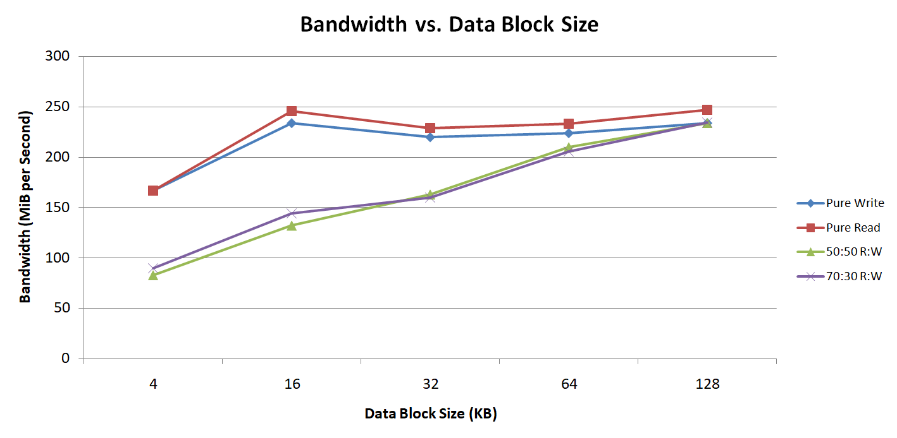
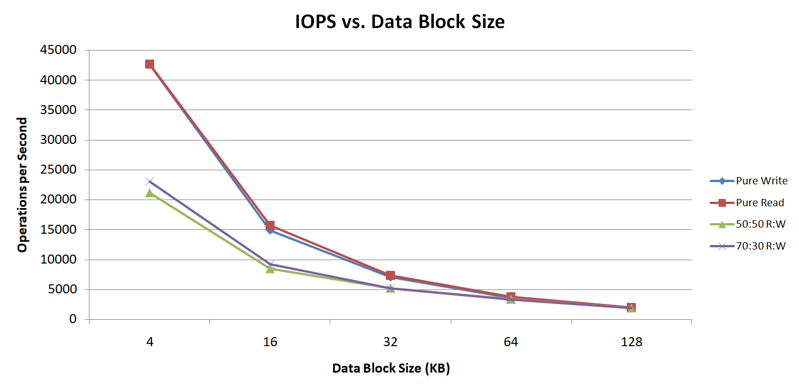
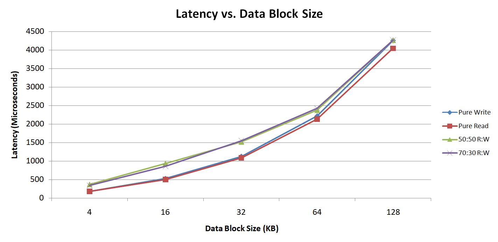
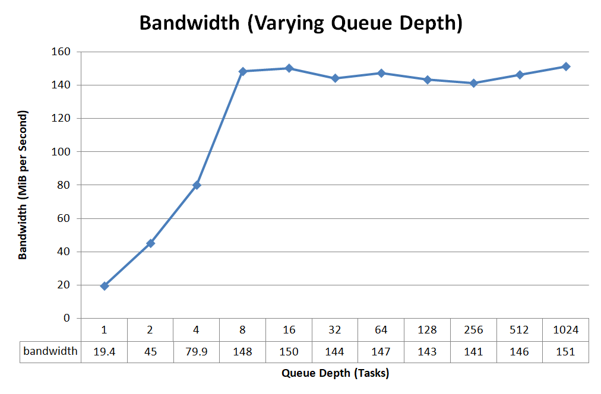
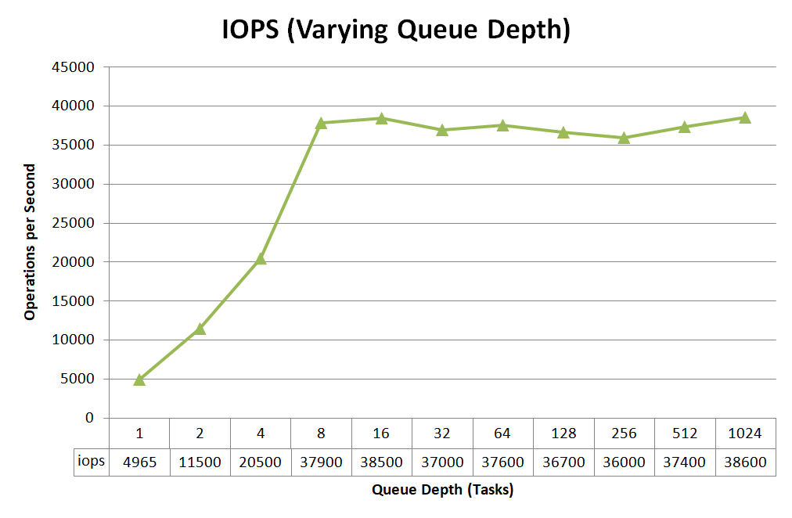
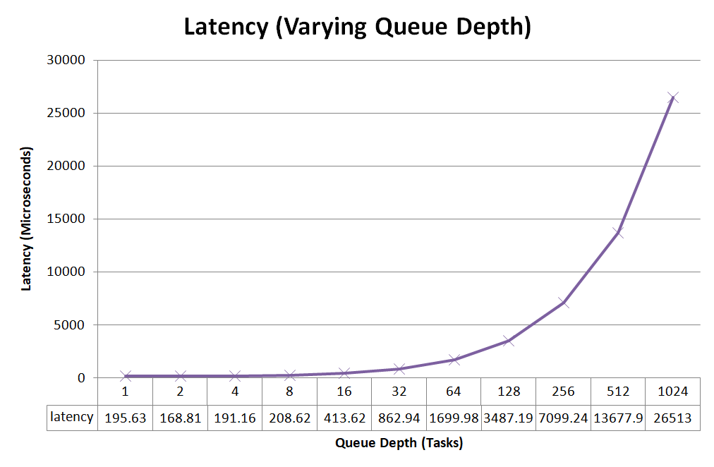

# Project 3: Results and Analysis

## Submission Information

**Andrew Prata, (https://github.com/apratajr/AdvancedComputerSystems/)**

*ECSE 4320: Advanced Computer Systems* Fall 2023

Due: 25-Oct-2023

## What Is Covered Here?
This is a report detailing the experimental process of characterizing the performance of a Solid State Drive (SSD) using the Linux command-line utility Flexible IO Tester (FIO). Experimental deliverables are as follows:

`Latency` and `Throughput` must be determined for combinations of
    
    1. Data Access Size: 4KB, 16KB, 32KB, and 128KB
    2. Read/Write Intensity Ratio: RO, WO, and 70:30 R:W
    3. I/O Queue Depth: 0-1024 Tasks

The FIO utility is extremely powerful, and will be used to extract the latency and throughput data under these varied conditions. To see how this was done, please take a look at the section **Data Aquisition**. For the subsequent presentation and analysis of the data, please see **Results and Analysis**.

## Data Aquisition
### Setup
To start, I focused on getting a native Linux machine up and running. This would ensure that FIO would operate as intended and without any trouble that might result from running the OS in a virtual machine, or with the Windows Subsystem for Linux.

The selected machine is an old Lenovo Thinkpad T410, into which I installed a SATA SSD. The drive is an APPLE SSD SM256E, with capacity 251 GB. This drive is from approximately 2013, which has interesting consequences for the data recorded below (will be discussed later). The selected operating system is Ubuntu 22.04.3 Desktop, with a minimal installation. For exact information on the drive, see `Project_3/driveinfo.png`. For the system specification as listed by `neofetch`, see `Project_3/testsystem.png`.

### Testing
Testing was done using FIO with a datafile called `test.dat` on the system disk. This was convenient, as it avoided creating a new partition just for testing.

#### Block Size
To test different data access sizes, the FIO parameter `--bs` (or `--blocksize`) was adjusted. Other parameters were left alone for consistency of measurement. Thus, a static queue depth of 8 was assumed for all block size testing. Below is the general template used for acquisition of data with changing block size. The only value in this command that changed is the `4k`, which was replaced with `16k`, `32k`, `64k`, and `128k` in subsequent runs.

```
sudo fio --name=bstest_4k_w --filename=/mnt/test.dat --size=1G
--rw=randwrite --direct=1 --blocksize=4k --ioengine=libaio
--runtime=35 --numjobs=1 --time_based --iodepth=8
```

After running through the full suite of block sizes provided in the Project 3 Handout, the experiment above was repeated for other `--rw` (read/write) modes. The modes used correlate with what was requested in the handout: (1) `--rw=randwrite`, (2) `--rw=randread`, (3) `--randrw --rwmixread=70`, and (4) `--randrw`.

Modes (1) and (2) are self explanatory, and correspond to pure read/pure write. Mode (3) is read/write with a specified 70/30 (R/W) distribution. Finally, mode (4) is read/write with an implicit 50/50 (R/W) distribution.

#### Queue Depth
My testing of queue depth was simpler than the previous experiment, as it focused on only the effects of queue depth, and nothing else. For this reason, parameters other than `--iodepth` were not modified. This parameter was changed from `1` to `1024`, testing all of the powers of two in between. As with the previous experiment's description, the first command in the series is provided below as a template, however it is nearly identical to the previous command. The only difference is `--iodepth`, and that is indeed all that will change throughout this experiment. Again, the other major parameter `--blocksize` is constrained to a value for the duration of the experiment (`4Kb`).

```
sudo fio --name=qdtest_4k_r_1 --filename=/mnt/test.dat --size=1G
--rw=randread --direct=1 --blocksize=4k --ioengine=libaio
--runtime=35 --numjobs=1 --time_based --iodepth=1
```
Each result acquired using the above commands was then copied (example output shown in `Project_3/FIOexample.png`) into a text file and transfered to a *more modern machine*. Finally, relevant data (bandwidth, latency, IOPS) were then extracted and imported to an Excel sheet to be visualized as graphs. With that, we have covered all of the experimental setup details which allowed for data collection and presentation. See results for this SSD as well as my analysis below.


## Results and Analysis
Note: From this point forward, I will be considering *bandwidth* instead of *throughput*, as these are correlated in the general case (as discussed in ECSE 4320 lecture). The data collected from experimentation contains direct bandwidth figures, which is the main motivation for this decision.

### Effect of Block Size
The chart below shows the effect that changing the data block size imparts on bandwidth. These results are very interesting, because with an SSD, we would expect the increase between 4 and 16 Kb to continue for subsequent increases in data block size. My theory for this (supported by other data later) is that this drive being older is bandwidth limited by hardware for greater than 16 Kb. This is apparent when examining the clear plateau of the pure read/write workload which occurs beyond 16 Kb.

The mixed read/write data also reveals interesting information. It shows the expected scaling, moving in a predictable fashion from 4 to 128 Kb. The fact that it does not immediately saturate at the ~240 MiB/sec indicates that mixing read and write activity has some type of overhead that only disappears at high data block sizes (~128 Kb, where all curves converge).
<div style="text-align: center;">
</div>
<br />

The next chart displays operations per second as a function of data block size. The theory presented above regarding a mixed-read/write overhead is supported again here. We see a clear reduction in the number of operations per second with respect to pure reading and writing. This indicates that indeed, something about mixing reads and writes greatly increases the processing requirement for the drive controller. Monitoring data of other system resources indicated that they were not strained any more than with pure reading or writing, which only leaves the drive itself to blame.

<div style="text-align: center;">
</div>
<br />

The final consideration for block size comparison is latency. The chart below presents latency as a function of data block size. As you can see, all payload types strongly correlate with each other. There is a very slight but consistent increase in latency for mixed read/write over pure, but this is not the main factor of interest here. The most important observation is the clear inverse relationship between bandwidth and latency which holds in all queuing based systems. An interesting observation that we can extract from both the bandwith and latency charts is that the apparent most efficient data block size for this drive is 16 Kb. This is because the bandwith reaches a maximum at this point, yet latency continues to increase.

<div style="text-align: center;">
</div>
<br />

### Effect of Queue Depth
The next experiment aimed to examine the effects of queue depth on bandwidth and latency. *Queue depth* refers to the number of items that are waiting in the queue waiting to be serviced by the drive. In theory, increasing this value should result in higher bandwidth, and of course an correlated higher latency (items are *waiting* in a longer queue). Indeed, the increased bandwidth is seen as we increase depth of the queue. This occurs up to a depth of 8, and then a plateau forms from then on. This effect is yet another manifestation of the hardware limitations that were discovered in the previous experiment.
<div style="text-align: center;">
</div>
<br />

The next chart presents operations per second as a function of queue depth. Interestingly, the same increase to an eventual plateau is observed as with bandwidth. This is the case because we are leaving the data block size the same, while increasing utilization of the drive by maintaining a longer queue.

<div style="text-align: center;">
</div>
<br />

Latency is the final data for consideration, and is presented as a function of queue depth size in the chart below. As expected, the per-request latency increases with an increase in queue depth. A longer queue means a longer wait *in* that queue. However, the tradeoff is that (to a point) bandwidth of access is increasing with this increase in latency. As with the previous experiment, we can make an interesting connection between the bandwidth and latency graphs. The leftmost point in the bandwidth plateau is a depth of 8 tasks, and beyond this point bandwidth ceases to increase. However, latency **does** continue to increase, which means that this drive is suited to a queue depth of 8 for the best bandwidth to latency ratio.

<div style="text-align: center;">
</div>

### Conclusions and Final Remarks

This was a very interesting experiment, and it was fun to perform. I enjoyed working with the FIO tool, and found it to be very powerful for characterizing drives. The drive tested in this report was from an old Apple Mac Mini, and is from 2013. I had always assumed that SATA 3 SSDs were all very similar, but this project certainly showed me that this is not true!

After the two experiments, I have come to the conclusion that the approximate maximum bandwidth for this drive is 240 MiB/sec, or about 252 MB/sec. This is certainly faster than your average hard disk drive, but as far as SSDs are concerned, this is not exactly blazing speed. Note that I did experiment further with FIO to see if I was missing performance somewhere in the command line parameters, namely the `--numjobs` parameter. This parameter should, in theory, increase parallelization and thus maximize utilization of the drive. Unfortunately, this drive is so old that no noticeable performance gain was actualized by increasing this parameter. Lots of my ideas for experimentation came from an excellent YouTube video on FIO: https://www.youtube.com/watch?v=mBhXUYh-76o, suggested in the ECSE 4320 WebEx by Abdoula B.

While this old SSD is much faster than a spinning drive, it cannot even begin to compare to the Intel D7-P5600, which is a PCIe NVMe SSD. Even "good" SATA 3 drives, like my Samsung 860 EVO, would likely be blown away by the 130K IOPS of the Intel drive. If I were able to use my current boot drive, which is a Samsung 980, I would likely see the higher performance in IOPS that the Project Handout suggests. This is because the enterprise grade drive is performing data loss prevention actions (discussed in detail a few lectures ago in ECSE 4320) which the consumer grade one does not have to do. However, in my case with the old Apple drive, even the slowed-down Intel drive completely destroys it in performance.

Ultimately, one thing was proven true yet again in these experiments: the tangible tradeoff between bandwidth (throughput) and latency in queued systems.