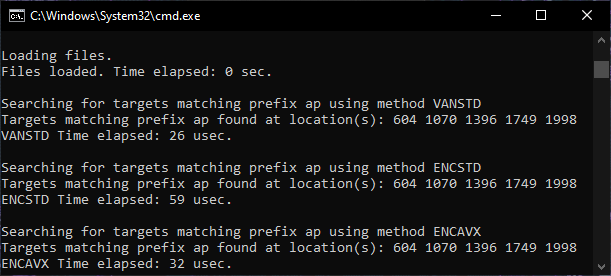
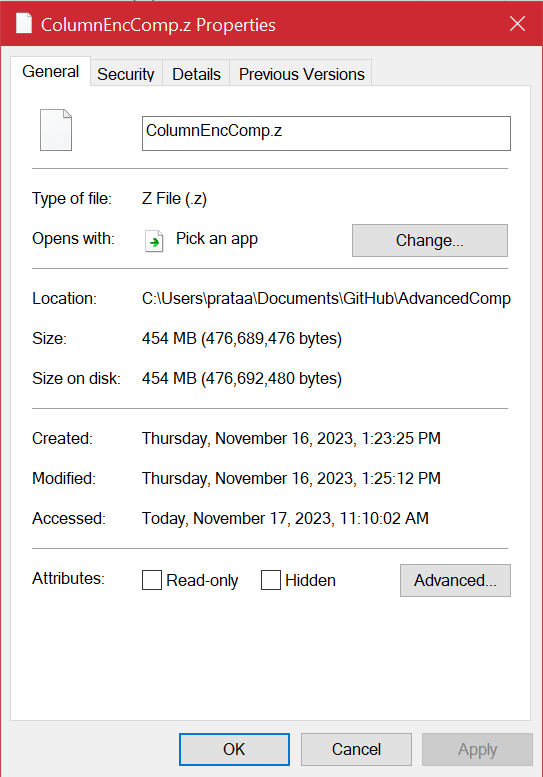

# Project 4: Dictionary Codec Implementation

## Submission Information

**Andrew Prata, (https://github.com/apratajr/AdvancedComputerSystems/)**

*ECSE 4320: Advanced Computer Systems* Fall 2023

Due: 11-Nov-2023

## Programming Deliverables
This section will cover the implementation of the system, and its basic functionality. Many issues were encountered along the way, and these, along with an overview of the development process, will be detailed as well.

The system is implemented in C++. due to its relative speed compared with other languages that I have experience in.

### Encoding
Given a raw column file, the system provides the function of creating an encoded equivalent, and writing it to the SSD. In this process, a dictionary which contains key,value pairs is created in memory. This is also written to the SSD for later lookup/scanning.

The data structure for the dictionary is shown below (it has been slimmed down for simplicity of explanation):
```cpp
class EncoderDictionary {
private:
    std::map<std::string, int> dictionary;
    int nextValue;
    std::mutex dictionaryMutex;
public:
    EncoderDictionary() : nextValue(0) {}

    int addKey(const std::string& key) {
        std::lock_guard<std::mutex> lock(dictionaryMutex);
        auto it = dictionary.find(key);

        if (it != dictionary.end()) {
            return it->second;
        } else {
            dictionary[key] = nextValue;
            return nextValue++;
        }
    }
    int getEncoding(const std::string& key) {
        std::lock_guard<std::mutex> lock(dictionaryMutex);
        auto it = dictionary.find(key);
        if (it == dictionary.end()) {
            return -1;
        }
        return dictionary.find(key)->second;
    }

    std::vector<int> getEncodingValuesWithPrefix(const std::string& prefix) {
        std::lock_guard<std::mutex> lock(dictionaryMutex);
        auto lower = dictionary.lower_bound(prefix);
        auto upper = dictionary.upper_bound(prefix + char(255));
        std::vector<int> encodingValues;
        for (auto it = lower; it != upper; ++it) {
            encodingValues.push_back(it->second);
        }
        return encodingValues;
    }
};
```

This stucture is simple to understand, and is effectively a wrapper for the standard C++ `std::map` structure. This wrapper encorporates automatic encoding generation, and mutexing. These functions are critical for the functioning of the system. The `mutex` is of course required for multithreaded construction of the encoding dictionary. The `nextValue` private member is used to set the next encoding in the sequence when we encounter a new string at encoding time.

Two member functions are shown here, and they are both highly important for search functionality. The first, `EncoderDictionary::getEncoding` is extremely simple and will not be discussed. More interesting is `EncoderDictionary::getEncodingValuesWithPrefix`, which takes advantage of the ordered tree-based structure of the underlying `std::map` to perform a very efficient scan for prefixes. We first define lower and upper bound iterators which effectively encompass all strings that start with our prefix. Finally, there is a simple for loop to walk over the entire range of prefixes automatically. Again, this would be impossible if `value:encoding` pairs were not ordered properly (e.g. using a `std::unordered_map` - this revelation came from Prof. Zhang in office hours...). Initial development of the `EncoderDictionary` design used an unordered structure, and thankfully the change was not very difficult.

### Query
Given a query term (`target` string), the program provides the function of locating the index locations of the term in the encoded file.

Within this section, there are references to the *memory representation* of the input data, encoded data, and dictionary. The actual `.txt` files containing them are read at runtime, and these are simply vectorized versions of those files for use in memory.

Declarations in `Project_4\main.cpp` for in-memory testing data:

```cpp
//-- INDICES REPRESENT ROW OF COLUMN --//
std::vector<std::string> inputraw;
std::vector<int> inputencoded;

//-- DICTIONARY INSTANCE AS DESCRIBED IN PREVIOUS SECTION --//
EncoderDictionary dictionary;
```

#### Vanilla Implementation
The system allows for basic vanilla operations on the input file. Functions exist for reading the input file into memory and querying it (using a `target`) from its memory representation.

"Vanilla search" from the Project Handout was considered to be a standard **O(n)** scan through memory in search of the `target`. Vector pushbacks were found to have a negligible computational impact on system performance, but for consistency they remained identical for all implementations. See below the vanilla standard (VANSTD) search:

```cpp
//-- METHOD VANSTD --//
bool searchInput(const std::vector<std::string>& input_data, std::string target, std::vector<int>& target_locations) {
    for (size_t i = 0; i < input_data.size(); ++i) {
        if (input_data[i] == target) {
            target_locations.push_back(i);
        }
    }
    return (target_locations.size() != 0) ? true : false;
}
```
This of course bypasses all dictionary and encoding related optimizations. We simply perform a walk through the dataset (in our case, `inputraw`) as it is in memory, and compare each row to the `target`.

#### Encoded Implementation
The encoded functionality of the system is obviously of primary interest in this experiment, and its implementation (ENCSTD) is displayed below. Note that comments have been omitted here for brevity, but the full code with comments can be reviewed at `Project_4\EncoderDictionary.h` if interested.

```cpp
//-- METHOD ENCSTD --//
bool searchEncoded(const std::vector<int>& encoded_data, EncoderDictionary& d, std::string target, std::vector<int>& target_locations) {
    int target_encoding = d.getEncoding(target);
    if (target_encoding == -1) {
        return false;
    }
    for (size_t i = 0; i < encoded_data.size(); ++i) {
        if (encoded_data[i] == target_encoding) {
            target_locations.push_back(i);
        }
    }
    return true;
}
```
In this implementation, we of course assume that the encoded file is preloaded in memory (as we assumed that the input was for VANSTD). Our first step is to acquire the encoding of our `target`. This involves simply querying the `EncoderDictionary` instance for the `target` encoding using the member function `getEncoding()`. This function, as you might guess from the code, either returns an unsigned integer encoding value, or `-1` if the `target` does not exist in the dictionary.

With our encoding, we then linearly search the encoded data vector in the same manner as VANSTD.

#### Encoded Implementation with SIMD Support
This is perhaps the most interesting implementation in the experiment, as it combines the efficiency of integer encoding with SIMD instructions, to perform a (theoretically) very efficient query search of the data. The method's implementation (ENCAVX) is shown below.

```cpp
//-- METHOD ENCAVX --//
bool searchEncodedSIMD(const std::vector<int>& encoded_data, EncoderDictionary& d, const std::string& target, std::vector<int>& target_locations) {
    int target_encoding = d.getEncoding(target);
    if (target_encoding == -1) {
        return false;
    }
    __m128i target_vec = _mm_set1_epi32(target_encoding);
    for (size_t i = 0; i < encoded_data.size(); i += 4) {
        __m128i data_vec = _mm_loadu_si128(reinterpret_cast<const __m128i*>(&encoded_data[i]));
        __m128i result = _mm_cmpeq_epi32(data_vec, target_vec);
        int comparison_result[4];
        _mm_storeu_si128(reinterpret_cast<__m128i*>(comparison_result), result);
        for (int j = 0; j < 4; ++j) {
            if (comparison_result[j] != 0) {
                target_locations.push_back(i+j);
            }
        }
    }
    return true;
}
```
To begin, we of course determine the encoding of the `target` using the same method as before with ENCSTD. Importantly, we then assume that the target encoding of any given `target:encoding` pair is less than the 32-bit integer limit. This allows us to use a 128-bit SIMD vector `target_vec` to load four copies of the target encoding. We will then loop over the encoded data vector in steps of 4, loading 128-bit SIMD vectors `data_vec` as we go. We then simply compare `data_vec` against `target_vec`, and record matches.

This division of the data source into SIMD-vector sized pieces is similar to previous experiments from this course.

### Prefix Scanning
Next, we will detail the prefix-scanning implementations for the three optimization levels already covered: vanilla (raw input - VANSTD), encoded standard (ENCSTD), and encoded with SIMD acceleration (ENCAVX).

"Prefix scanning" in this context means determining if and where in the original input a term starting with some specific string exists. Because the implementations of this task are effectively logical extensions of their previous Query Search counterparts, less detail will be provided to prevent repetition.

#### Vanilla Implementation
```cpp
//-- METHOD VANSTD --//
bool prefixSearchInput(const std::vector<std::string>& input_data, std::string target_prefix, std::vector<int>& target_locations) {
    for (size_t i = 0; i < input_data.size(); ++i) {
        if (input_data[i].compare(0, target_prefix.length(), target_prefix) == 0) {
            target_locations.push_back(i);
        }
    }
    return (target_locations.size() != 0) ? true : false;
}
```
The only major change to the vanilla implementation is that we now perform a `std::string::compare` of the first `N` characters of each input data value against the `target_prefix`, where `N`=(length of prefix). We then pushback each location where the comparison is valid. This is a trivial solution, and is relatively uninteresting.

#### Encoded Implementation
```cpp
//-- METHOD ENCSTD --//
bool prefixSearchEncoded(const std::vector<int>& encoded_data, EncoderDictionary& d, std::string target_prefix, std::vector<int>& target_locations) {
    std::vector<int> target_encodings = d.getEncodingValuesWithPrefix(target_prefix);
    if (target_encodings.size() == 0) {
        return false;
    }
    for (size_t i = 0; i < encoded_data.size(); ++i) {
        for (size_t j = 0; j < target_encodings.size(); ++j) {
            if (encoded_data[i] == target_encodings[j]) {
                target_locations.push_back(i);
            }
        }
    }
    return true;
}
```
With encodings, we cannot perform the same string comparison, as we only have integers. However, we can do something else which is theoretically even better.

We start by querying the dictionary for encoding values using the the `EncoderDictionary::getEncodingValuesWithPrefix` member function. This function is interesting compared to `getEncoding`, and strongly leverages the ordered nature of the data structure (it is covered in detail at the beginning of **Programming Deliverables**).

With a vector of encodings where our `target_prefix` condition is met, we then simply perform a nested loop check using this vector and the encoded data vector.

#### Encoded Implementation with SIMD Support
The code for the SIMD implementation of encoded prefix scanning is extremely similar to the SIMD Query Search, except that it has an nested loop that checks each of the prefix matches, in the same manner as the regular encoding prefix scanning implementation. Understanding these two prior functions is equivalent to understanding this one. For this reason, I will spare you another 35 line block of code... although it is available at `Project_4\EncoderDictionary.h`.

## Analysis
This section will present and discuss the performance characteristics of the implementations for both query search and prefix scan. Of course, in all charts provided, *lower is better*, as we are dealing with function execution time.


### Query Search
Query search as implemented in this experiment proved to be a total success. Importantly, all functions were checked for coherency with one another, to ensure that they were successfully evaluating the queries.  As shown in the chart below, the three methods tested on a small dataset (first 2000 lines of provided `Column.txt`) all execute consistently in the expected time range. VANSTD is slowest, ENCSTD is faster, and ENCAVX is fastest.

<div style="text-align: center;">
</div>
<br />

This behavior scales perfectly to the full-sized (~1 GB) `Column.txt` file, as shown below.

<div style="text-align: center;">
</div>
<br />

Individual run data reveals that, interestingly, the standard deviation of runtime decreases with input size. Also, the data suggests that the larger the input size, the larger the benefits of encoding-based querying strategies, which aligns with theory. On the full dataset, the nominal runtime reduction from VANSTD to ENCSTD is 62%, and the reduction from VANSTD to ENCAVX is over 73%!

### Prefix Scan
Prefix scanning was less successful than query searching in this experiment. Implementations appear correct, (available in previous sections) however runtime data suggests an error.

The chart below shows the three methods tested on the same small dataset as before.

<div style="text-align: center;">
</div>
<br />

This data is strange, because it suggests that (at least at this dataset size), standard vanilla scanning operations are consistently faster and more efficient than their encoded counterparts. This could be explained logically as the encoding overhead (dictionary) and encoding AVX overhead (dictionary, SIMD loading) outweighing benefits at such a small data size. Unfortunately, due to the current program design, a full-dataset run was impossible due to specific vectors never being cleared. Because these vectors never exited the global scope, the system would almost immediately run out of memory under testing of different methods, making it very difficult to acquire good data. However, we can make the assumption that if the design were improved to dynamically allocate and release memory for these vectors, the program would run as expected. In that case, we would likely see the scaling shown in the Query Search testing, where ENCAVX is the winner overall.

Initially, I thought that perhaps the prefix scan functionality was broken in the encoded cases, which was causing some severe time sink. In testing, I found that the function *are* working as expected, and match the VANSTD implementation perfectly. Here is a window capture showing this coherency:

<div style="text-align: center;">
</div>
<br />

## Development and Design Failures
Development was rough for a good portion of this project, despite the relatively simple codebase that I have to show for it. The first serious issue was my understanding of the project requirements, which was quickly cleared up with office hours and class discussion. Things like compression, memory/disk representation, and encoding schemes were slightly misunderstood enough to halt progress. Getting past these, I attempted (to no avail) to get multithreaded dictionary generation (encoding) to function.

### Multithreaded Encoding Dictionary Generation
The general idea behind multithreaded encoding is that unlike file writing, generating a dictionary in-memory should be able to be divided into concurrent unrelated threads. This is a basic concept, however my implementation as it stands fails to properly implement it. Increasing the number of threads utilized in my implementation actually causes an (approximately linear) *increase* in encoding time. This is highly unexpected, and indicates that there is certainly a problem. My conclusion based on hours of debugging is that mutexing is either implemented incorrectly or simply cannot be used with the structure I have designed for the encoding dictionary. This is related to the "I" in "ACID" from transaction theory discussed in lecture: Atomicity, Consistency, ***Isolation***, and Durability. Concurrent threads are interfering with each others' dictionary access. I believe this to a contention for resources: many threads are trying to access the dictionary at the same time, but all but one are locked by the mutex hold of the current execution thread. Initial revisions caused a complete deadlock, where the process would halt and be unable to recover due to the first thread failing to release its lock. The current revision *does* run, and the dictionary *is* correct, it is just very slow. This requires additional investigation.

### Disk Integer Compression
The Project Handout calls for integer compression to be used to further reduce the footprint of encoded data on the storage medium. A suggested option from office hours was FastPFor (https://github.com/lemire/FastPFor). This code does indeed appear to be what I need, however unfortunately (and yet again) my Windows-based system will not allow me to use this software, as I cannot build it. Linux my find a home on my boot drive soon...

Out of curiosity, I did use the classic LZ comression scheme to attempt to reduce the data size using a simple script (not apart of the main project). Results showed that even this basic compression, not specifically suited to integers, resulted in a drop from just over a gigabyte to under half of one! This is a pretty good compression ratio in my opinion, especially considering that this algorithm is not even tailored to this type of data.

<div style="display: flex; justify-content: space-between;">
  
  
</div><br />

## Conclusion and Final Remarks
I learned a lot in this project, and it was actually rather enjoyable to work on. I honestly did not expect to see such a performance uplift when switching from plain text data to encoded integer representations when querying. Prefix scanning is of course a letdown, and without firther work to modify the test program and data structure, it cannot be said with certainty that performance would scale as expected for large inputs. Despite this, the implementations were interesting and enjoyable to work with.

Experimenting with multithreading was also interesting (if not a little bit infuriating). It was my first real experience with mutexing, despite having trivially interacted with mutexes in past experiences. Learning that the data structure which I chose is inherently thread-unsafe was a bit concerning, but was a teaching experience.

Overall, I learned a lot about the dictionary codec concept, and the supporting functions and structures that facilitate its functioning.